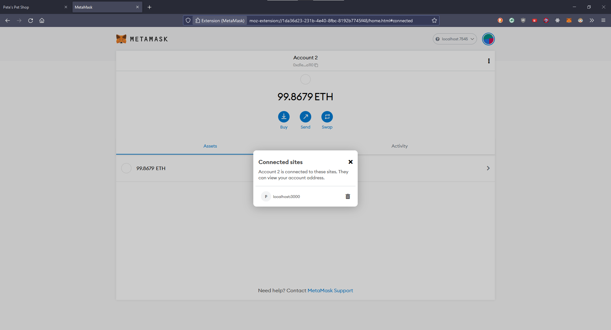
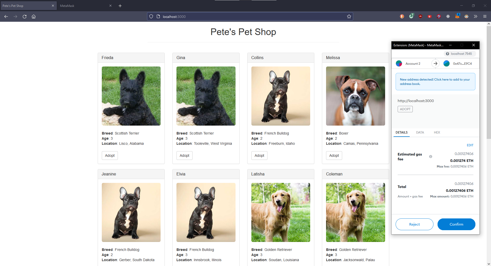
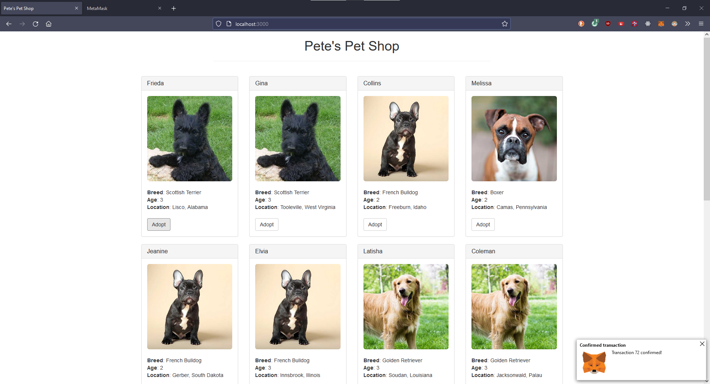
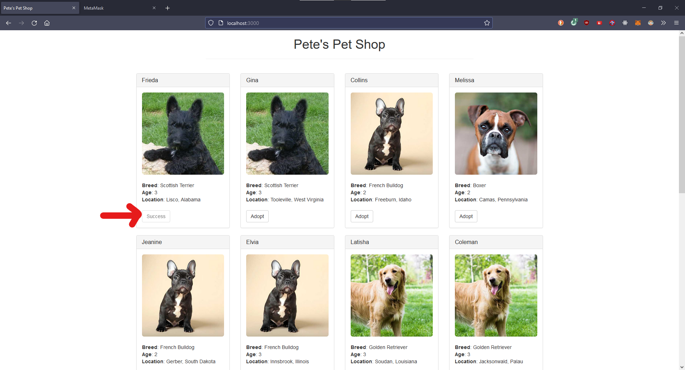
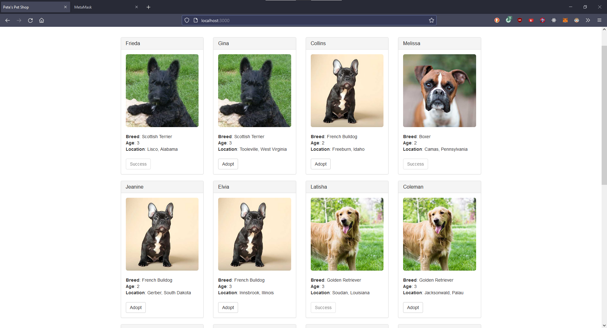

# pet-shop-clone

## Installation
1. Git clone [ankurwasnik/pet-shop-clone repository](https://github.com/ankurwasnik/pet-shop-clone.git) ` git clone https://github.com/ankurwasnik/pet-shop-clone.git`
2. Install npm dependencies `npm install`
3. Open [Ganache Suit](https://trufflesuite.com/ganache)
4. Install truffle `npm install -g truffle`
5. Deploy the contracts `truffle deploy`
6. Hit `npm run dev`. It will open web browser on http://localhost:3000
7. Connect metamask with ganache account
8. Enjoy the pet adoption in decentralized way

## Suggestions | Feedback
If you find any bug, report to [project owner](https://github.com/ankurwasnik)\
or see more in contact section.

## Demo
1. Go to localhost:3000 to see the homepage\

2. Connect the metamask account to localhost at port 3000\

3. Click on adopt button of any pet listed\

4. Confirm the transaction on metamask\

5. See the "Adopt" button is now changed to "Success"\

6. You can adopt many pets as you can\

## Contact
Twitter : [@ankurwasnik358](https://twitter/ankurwasnik358)\
***
Last date modified : 13th Jan 2021
